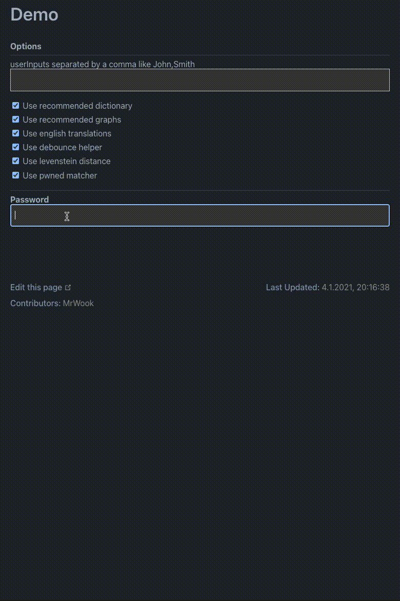

# zxcvbn-ts

This is a complete rewrite of [zxcvbn](https://github.com/dropbox/zxcvbn) into typescript
which is licensed under the [MIT](https://github.com/dropbox/zxcvbn/blob/master/LICENSE.txt) license.
Thanks to the original creators [dropbox](https://github.com/dropbox) for the great work.

> zxcvbn is a password strength estimator inspired by password crackers. 
> Through pattern matching and conservative estimation, 
> it recognizes and weighs 40k common passwords, 
> common names surnames, popular words from Wikipedia and common word in different language from different countries, 
> and other common patterns like dates, repeats (aaa), sequences (abcd), keyboard patterns (qwertyuiop), and l33t speak.
>
> Consider using zxcvbn as an algorithmic alternative to password composition policy — it is more secure, 
> flexible, and usable when sites require a minimal complexity score in place of annoying rules like "passwords must contain three of {lower, upper, numbers, symbols}".
>
> - More secure: policies often fail both ways, allowing weak passwords (P@ssword1) and disallowing strong passwords.
> - More flexible: zxcvbn allows many password styles to flourish so long as it detects sufficient complexity — passphrases are rated highly given enough uncommon words, keyboard patterns are ranked based on length and number of turns, and capitalization adds more complexity when it's unpredictaBle.
> - More usable: zxcvbn is designed to power simple, rule-free interfaces that give instant feedback. In addition to strength estimation, zxcvbn includes minimal, targeted verbal feedback that can help guide users towards less guessable passwords.
> For further detail and motivation, please refer to the USENIX Security '16 [paper and presentation](https://www.usenix.org/conference/usenixsecurity16/technical-sessions/presentation/wheeler).

The reason of this project is to modernize zxcvbn and make it maintainable with new features.

- [Features](#features)
- [Documentation](#Documentation)
- [LanguagePackages](#LanguagePackages)
- [Comparison](#Comparison)
- [Contribution](#Contribution)

## Features

- estimate strength of a password
- get a score for the password
- i18n support, for dictionaries and feedback translations
- extend existing dictionaries with your own
- usable without dictionaries at all, which reduce the scoring efficiency rapidly. This is not recommended
- types
- custom matcher
- [haveibeenpwned](https://haveibeenpwned.com/Passwords) matcher

## Documentation

Checkout the [Documentation](https://zxcvbn-ts.github.io/zxcvbn/).
There you will also find the [Demo](https://zxcvbn-ts.github.io/zxcvbn/demo/) pages
and the [Migration](https://zxcvbn-ts.github.io/zxcvbn/guide/migration) guide.

## LanguagePackages

If your language is missing as a language pack checkout the [guide](https://zxcvbn-ts.github.io/zxcvbn/guide/languages/#add-a-new-language-package) to add your own.

## Comparison

If you want to know how much the scoring changed compared to the original checkout the [comparison](https://zxcvbn-ts.github.io/zxcvbn/guide/comparison) page.

## Contribution

Please feel free to [open up an issue](https://github.com/zxcvbn-ts/zxcvbn/issues/new) or provide a pull request.
